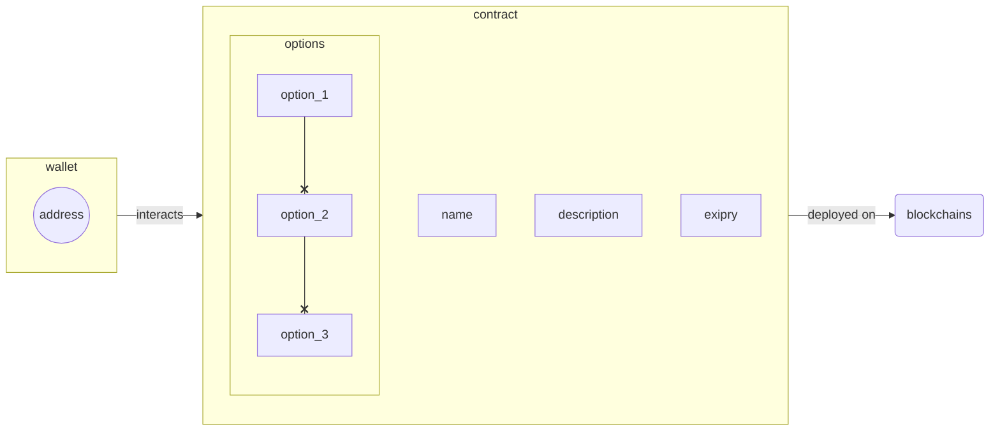

# Једноставни систем за гласање
Овај репо садржи код контракта написаних у `Solidity`-ју који представњају једноставан систем за гласање/анкетирање корисника.

## Функционалности
Следеће функционалносту су подржане:
  - [ ] креирање анкете (_Minting ankete_)
    - име
    - кратак опис
    - анкетне опције
        - до 5 опција за избор (_опције базиране на текстуалном опису_)
    - датум истека анкете (_deadline ankete_)
  - [ ] преглед детаља анкете (_aka **Преглед**_)
  - [ ] избор анкетне опције (_aka **Избор**_)
  - [ ] преглед свих анкета у систему
  - [ ] пријава ”неадекватних” анкета (_aka **Процес пријаве**_)

## Структура
> Contracts structure: _WIP_

## Постављање на блокчејн мреже (_deployment_)
Постављање се врши преко ”[Truffle](https://trufflesuite.com/) CLI” пакета. (_погледајте упутства за инсталацију на самом сајту, у зависности од ваше платформе_)

> _Следеће **тест** мреже су подржане: TBD_

---
Направио: [Vexy](https://github.com/vexy) (`6302D860 B74CBD34 6482DBA2 518766D0 8213DBC0`)  
Направљено у Србији, априла 2022 🇷🇸  

Copyright (c) 2022  
