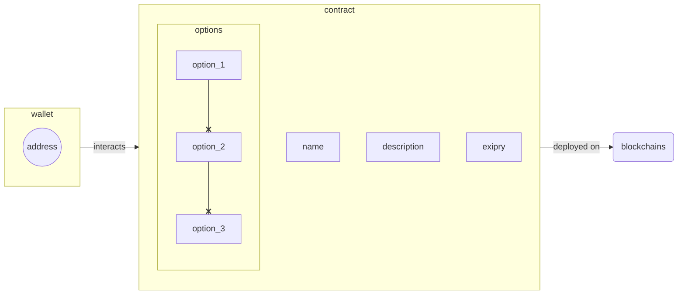

# Једноставна платформа за гласање
Овај репо садржи код једноставне _платформе за гласање_ написан у `Solidity`-ју и `JavaScript`-у. Помоћни, једноставни фронтенд је написан у `SvelteKit` фрејмворку.

_НАПОМЕНА: **ПРОЈЕКАТ ЈЕ И ДАЉЕ У АКТИВНОМ РАЗВОЈУ**_  

По потреби, проверавајте стање [пројекта](https://github.com/vexy/simple_voting/projects/1) и/или пријавите [проблем](https://github.com/vexy/simple_voting/issues).

## Основне функционалности
Платформ подржава следеће функционалности:
  - Добијање гласачког токена (_тзв. **Minting**_)
  - Преглед листе јавних анкета:
    - преглед детаља анкете (_тзв. **Browsing**_)
    - преглед затворених/не активних анкета (_TBD_)
    - пријава неодговарајућих анкета (_тзв. **Reporting**_)
  - Учествовање у анкети (одговарање на анкетно питање) (_тзв. **Voting**_)
  - Креирање нове анкете (_тзв. **Creating Poll**_)

### Предуслови
За употребу ове платформе потребно је поседовање неког дигиталног новчаника (_digital wallet_) који је подешен за повезивање на локалну мрежу. У овом тренутку, једино је подржан [MetaMask](https://metamask.io/) новчаник.

За потпуну употребу ове платформе, следеће компоненте је потребно инсталирати пре свега:
1. Node/NPM
2. Hardhat NPM library
3. Metamask wallet (and browser extension)

Најлакши начин за инсталацију `Hardhat`-а (уз подразумевани NPM који је инсталиран) би био:
```
npm install --save-dev hardhat
```

Такође, инсталирајте следеће библиотеке, у колико саме нису инсталиране:
```
npm install --save-dev @nomiclabs/hardhat-waffle ethereum-waffle chai @nomiclabs/hardhat-ethers ethers
```

Унесите следеће у терминал, као потврду да је инсталација неопходних ствари прошла без проблема:
```
npx hardhat compile
```

## Постављање на блокчејн мреже (_deployment_)
Постављање се врши преко [Hardhat CLI](https://hardhat.org/) система. Погледајте упутства за инсталацију на самом сајту, у зависности од ваше платформе.

За покретање тестова у локалу, потребно је подесити вашу локалну блокчејн мрежу према подразуеваним параметрима (_ускоро и подршка за Truffle suite_).

Користите следеће команде за тестирање платформе:
```
# постављање на локалну мрежз
npx hardhat --network localhost scripts/migration.js

npx hardhat test
npx hardhat --network localhost test
```

Погледајте [`/scripts`](/scripts/) фолдер за више информација о тестовима.

# Структура
> Структура контракта је и даље у развоју.



---
Направио: [Vexy](https://github.com/vexy) | Направљено у Србији, априла 2022 🇷🇸  | Copyright (c) 2022  
<a href="https://stackexchange.com/users/215166">
  
</a><br>
**PGP**: `6302D860 B74CBD34 6482DBA2 518766D0 8213DBC0`