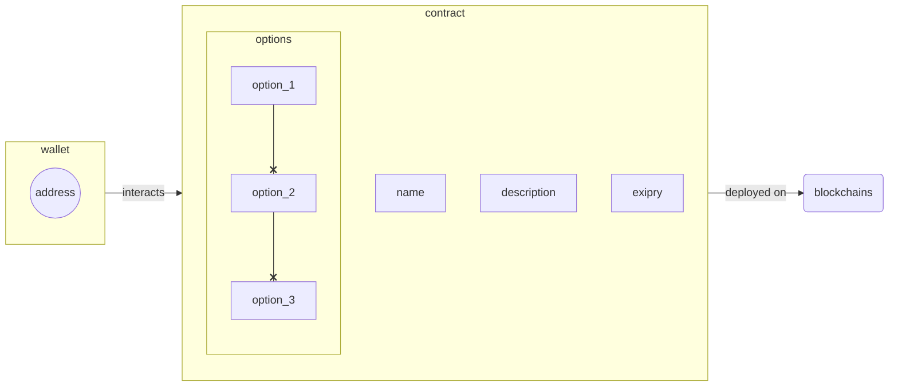

# Simple Voting platform
This is an example of blockchain based voting platform consisting of following components:
  - `Solidity` based smart-contracts
  - user facing side, written in `TypeScript/JavaScript` and `SvelteKit`

[](https://wakatime.com/badge/github/vexy/simple_voting?style=for-the-badge)

_PLEASE NOTE: **PROJECT IS IN ACTIVE DEVELOPMENT**_  
> _Follow the progress on [project board](https://github.com/vexy/simple_voting/projects/1) or report an [issue](https://github.com/vexy/simple_voting/issues) if you run into trouble_  
> _Version: 0.6_

## Feature set
Following is the set of supported features:
  - easy setup and self hosting
  - free user registration
  - free question posting
  - browsing the list of registered questions
    - preview poll details
    - report inapropriate polls (_aka **Reporting**_)
  - vote for specific options

### Prerequisities
In order to fully run this platform, following is a list of pre-requisities:
1. node/npm (node `v16.15` / npm `v8.5.5`)
2. [hardhat](https://hardhat.org/getting-started/#installation) `v2.11.2`
3. [MetaMask](https://metamask.io/) wallet or (browser extension [chrome extension](https://chrome.google.com/webstore/detail/metamask/nkbihfbeogaeaoehlefnkodbefgpgknn?hl=en))
(_right now only Metamask is supported, more wallets comming soon_)

After installing hardhat, make sure the following libraries are installed:
```
npm install --save-dev @nomicfoundation/hardhat-toolbox
```

Finally, you can check if everything works well by typing:
```
npx hardhat compile
```

Checkout open [issues](https://github.com/vexy/simple_voting/issues) or open another one if you run into trouble.

## Deployment info
> _Currently, **only** test-nets are supported. TBD_

Deployment is performed using [Hardhat CLI](https://hardhat.org/).  

In order to run local test, first setup local development network of your choice.

```
npx hardhat compile
npx hardhat test

# deploy to local network
npx hardhat --network localhost scripts/migration.js
```

Check the [`/scripts`](/scripts/) folder for more information.

> _Main-net **deployment comming soon**_

## Platform structure
> Contracts is _WIP_. Following structure may change in future.



# Contributing guide
PRs and any sort of contribution is **more than welcome**. 🙌  
Just check the [project board](https://github.com/vexy/simple_voting/projects/1) and help yourself with a nice little task suited to your needs :)  

> **!! THANK YOU IN ADVANCE !!**

---
Copyright (C) 2022 [Vexy](https://github.com/vexy)  
<a href="https://stackexchange.com/users/215166">
  
</a><br>
**PGP**: `6302D860 B74CBD34 6482DBA2 518766D0 8213DBC0`
