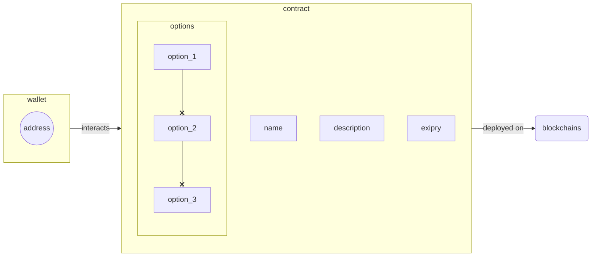

# Simple Voting system
Simple voting system written in `Solidity`.

## Contract features
Following features are supported:
  - [ ] creating new pool (_Minting a poll_)
    - poll name
    - description
    - poll options
        - up to 5 options (_string based_)
    - expiry date
  - [ ] preview poll details (_aka **Voting**_)
  - [ ] selecting poll answer (_aka **Voting**_)
  - [ ] listing all polls
  - [ ] report/flag poll (_aka **Reporting Process**_)

### Voting

### Reporting a poll

## Structure
> Contracts structure: _TBD_

## Deployment info
> _Currently, **only** test-nets are supported._  
Deployment will be performed with `Truffle CLI`.
_TBD_

---
Created by [Vexy](https://github.com/vexy). Copyright (c) 2022  
PGP: `6302D860 B74CBD34 6482DBA2 518766D0 8213DBC0`