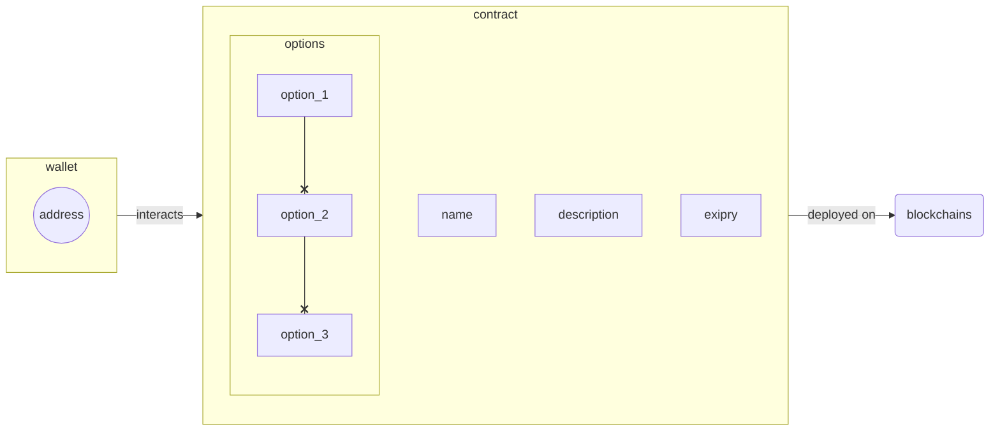

# Simple Voting platform
This repo represents basic blockchain based voting platform, based on smart-contracts written in `Solidity` and client side written in `JavaScript`. Simple companion website was made using `SvelteKit`.

Check the current progress of the [project](https://github.com/vexy/simple_voting/projects/1) or report and [issue](https://github.com/vexy/simple_voting/issues) if you run into trouble.

_PLEASE NOTE: **PROJECT IS STILL IN HEAVY DEVELOPMENT**_

## Main feature-set
Voting platform supports following features:
  - Obtaining voting token from the platform (_aka Minting_)
  - Browsing the list of available polls
    - preview poll details (_aka **Browsing**_)
    - preview closed/expired polls (_TBD_)
    - report inapropriate polls (_aka **Reporting**_)
  - Selecting poll answer (_aka **Voting**_)
  - Posting new poll (_aka **Creating Poll**_)

### Prerequisities
In order to run this contract, make sure you have some digital wallet installed and properly configured. At this point, only [MetaMask](https://metamask.io/) wallets are supported. 

In order to fully run this platform, following is a list of pre-requisities:
1. Node/NPM
2. Hardhat NPM library
3. Metamask wallet (and browser extension)

Easiest way to install `Hardhat` (assuming NPM installed) would be:
```
npm install --save-dev hardhat
```

If not specifically noted, make sure the following libraries are installed:
```
npm install --save-dev @nomiclabs/hardhat-waffle ethereum-waffle chai @nomiclabs/hardhat-ethers ethers
```

Quick check to make sure contracts could be compiled and that everything works well:
```
npx hardhat compile
```

## Deployment info
> _Currently, **only** test-nets are supported. TBD_

Deployment is performed using [Hardhat CLI](https://hardhat.org/).  

In order to run local test, first setup local development network of your choice (_will work with Truffle suite soon_).

```
npx hardhat compile
npx hardhat test

# deploy to local network
npx hardhat --network localhost scripts/migration.js
```

Check the [`/scripts`](/scripts/) folder for more information.

> _Main-net **deployment comming soon**_

# Platform structure
> Contracts is _WIP_. Following structure may change in future.



# Contributing guide
PRs and any sort of contribution is **more than welcome**. Just check the [project board](https://github.com/vexy/simple_voting/projects/1) and help yourself with a nice little task suited to your needs :)  

**!! THANK YOU IN ADVANCE !!**

---
Created by [Vexy](https://github.com/vexy) | Copyright (C) 2022  
<a href="https://stackexchange.com/users/215166">
  
</a><br>
**PGP**: `6302D860 B74CBD34 6482DBA2 518766D0 8213DBC0`
